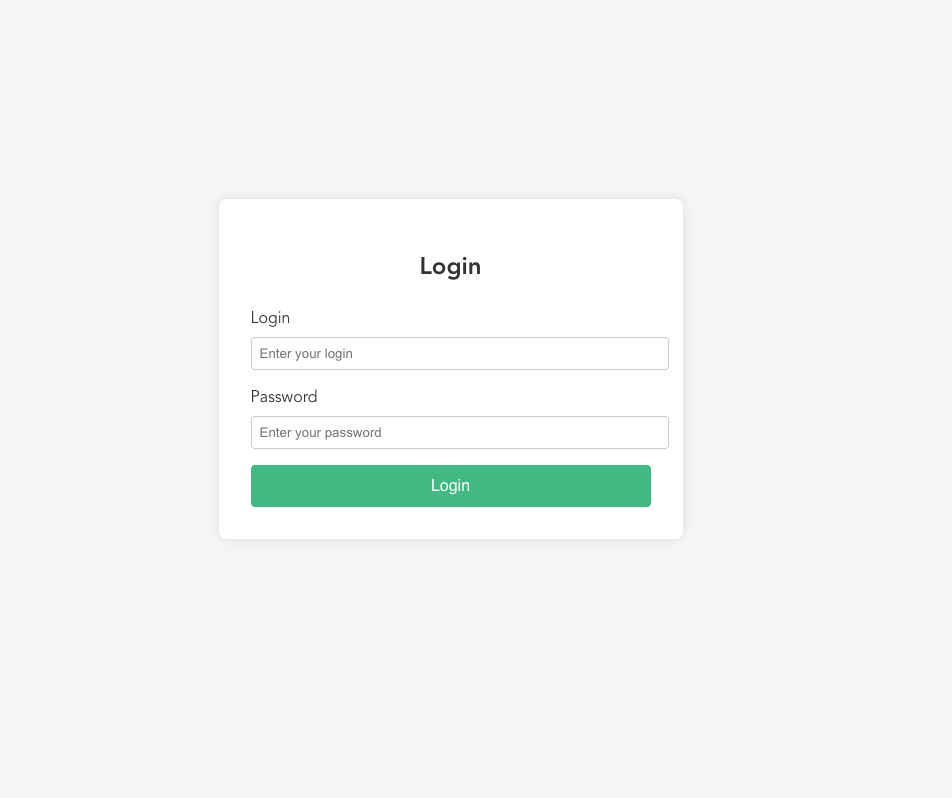
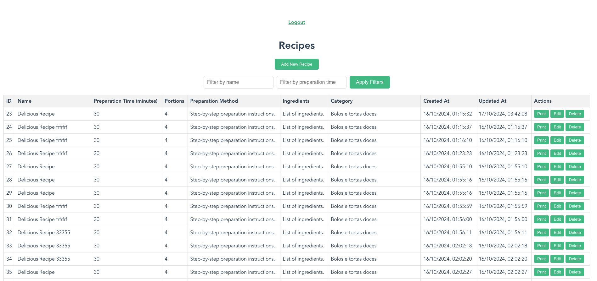
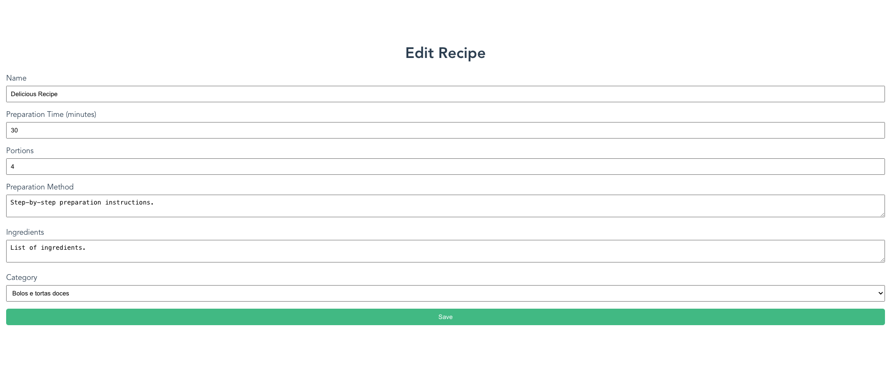
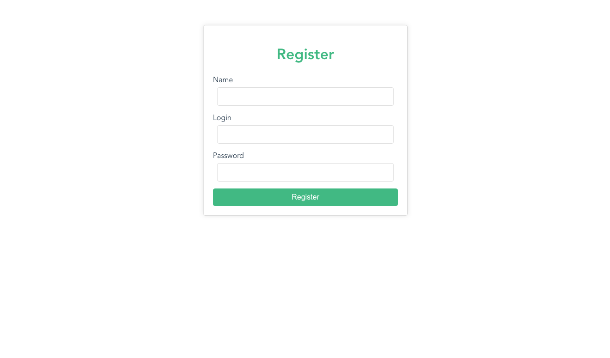

# Recipes By User Challenge

An application using Nodejs + Typescript + Vue3 + MySQL for Recipes By User APP

## Introduction

This project is an API that includes a backend built with Nodejs + Typescript, and a frontend build with Vue3 + Typescript. The database is containerized using Docker, allowing for easy deployment and management. 

## Table of Contents

- [Installation](#installation)
- [Usage](#usage)

## Installation

### Prerequisites

- [Docker](https://www.docker.com/)

### Setup

1. **Clone the repository:**

    ```bash
    git clone git@github.com:francysreymer/recipes-by-users-nodejs-vue3.git
    cd recipes-by-users-nodejs-vue3
    ```

2. **Run the docker for MySQL:**

    ```bash
    docker compose up -d
    ```

3. **Inside the backend folder -> Copy the .env.example and rename to .env and then set the JWT_TOKEN and PEPPER for passwords:**

4. **Inside the frontend folder -> Copy the .env.example and rename to .env and then set the VUE_APP_APP_PORT as the same you have previously set for the APP_PORT to the backend:**

5. **Then run, inside the backend folder, the command:**

    ```bash
    npm start
    ```

6. **Then run, inside the frontend folder, the command:**

    ```bash
    npm run serve
    ```
The application should now be runnig at [http://localhost:8082](http://localhost:8082).
You should see a login page like this:




## Usage

- **Frontend:** Accessible at [http://localhost:8082](http://localhost:8082).

## Pages After Login

After logging in, users will be able to navigate through the following pages:

### Recipes

The locations provides a page that shows all the city,states created by the logged user.



### Add/Update Recipe

The Add/Update Page allows the logged user to add/update recipes.



### Register User

The Register User Page allows the registering for new users so that they can have access to create their own recipes.

